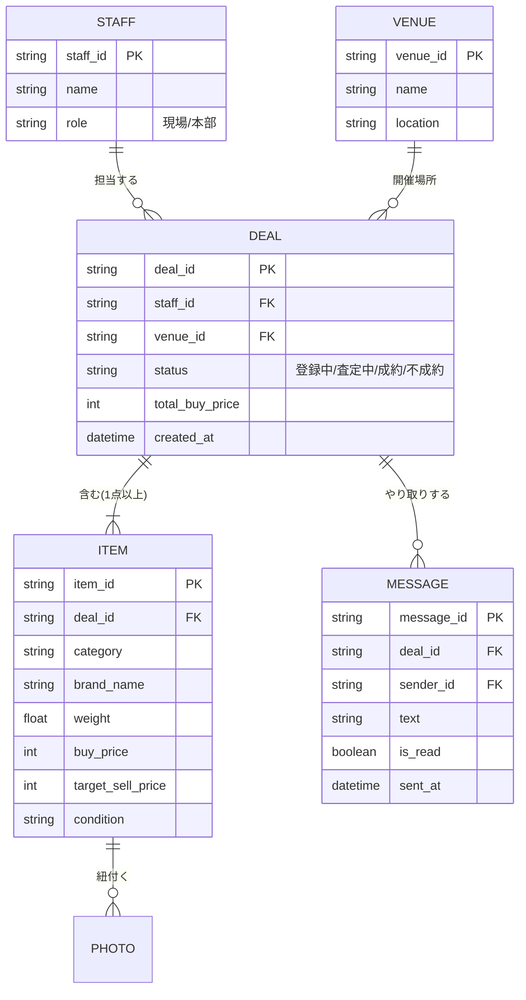

```mermaid
erDiagram
    STAFF ||--o{ DEAL : "担当する"
    VENUE ||--o{ DEAL : "開催場所"
    DEAL ||--|{ ITEM : "含む(1点以上)"
    DEAL ||--o{ MESSAGE : "やり取りする"
    ITEM ||--o{ PHOTO : "紐付く"

    STAFF {
        string staff_id PK
        string name
        string role "現場/本部"
    }
    VENUE {
        string venue_id PK
        string name
        string location
    }
    DEAL {
        string deal_id PK
        string staff_id FK
        string venue_id FK
        string status "登録中/査定中/成約/不成約"
        int total_buy_price
        datetime created_at
    }
    ITEM {
        string item_id PK
        string deal_id FK
        string category
        string brand_name
        float weight
        int buy_price
        int target_sell_price
        string condition
    }
    MESSAGE {
        string message_id PK
        string deal_id FK
        string sender_id FK
        string text
        boolean is_read
        datetime sent_at
    }
```