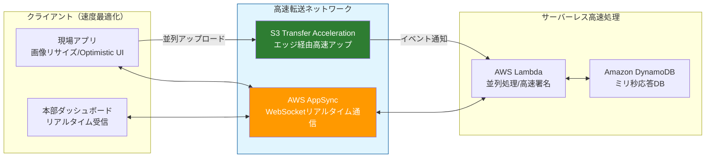

```mermaid
graph LR
    subgraph Client ["クライアント（速度最適化）"]
        Buyer[現場アプリ<br/>画像リサイズ/Optimistic UI]
        HQ_User[本部ダッシュボード<br/>リアルタイム受信]
    end

    subgraph Speed_Layer ["高速転送ネットワーク"]
        S3Accel[S3 Transfer Acceleration<br/>エッジ経由高速アップ]
        AppSync[AWS AppSync<br/>WebSocketリアルタイム通信]
    end

    subgraph Backend ["サーバーレス高速処理"]
        Lambda[AWS Lambda<br/>並列処理/高速署名]
        DynamoDB[Amazon DynamoDB<br/>ミリ秒応答DB]
    end

    Buyer -- "並列アップロード" --> S3Accel
    S3Accel -- "イベント通知" --> Lambda
    Buyer <--> AppSync
    HQ_User <--> AppSync
    AppSync <--> Lambda
    Lambda <--> DynamoDB

    style Speed_Layer fill:#e1f5fe,stroke:#01579b
    style AppSync fill:#ff9900,color:#fff
    style S3Accel fill:#2e7d32,color:#fff
```