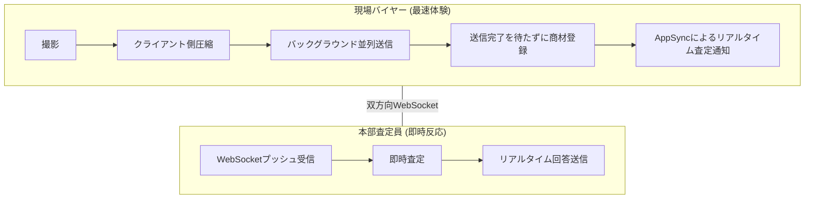

```mermaid
graph TD
    subgraph Buyer ["現場バイヤー (最速体験)"]
        A[撮影] --> B[クライアント側圧縮]
        B --> C[バックグラウンド並列送信]
        C --> D[送信完了を待たずに商材登録]
        D --> E[AppSyncによるリアルタイム査定通知]
    end

    subgraph HQ ["本部査定員 (即時反応)"]
        F[WebSocketプッシュ受信] --> G[即時査定]
        G --> H[リアルタイム回答送信]
    end

    Buyer -- "双方向WebSocket" --- HQ
```